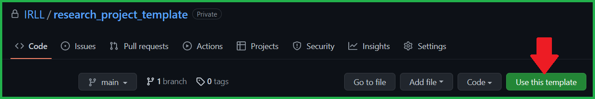
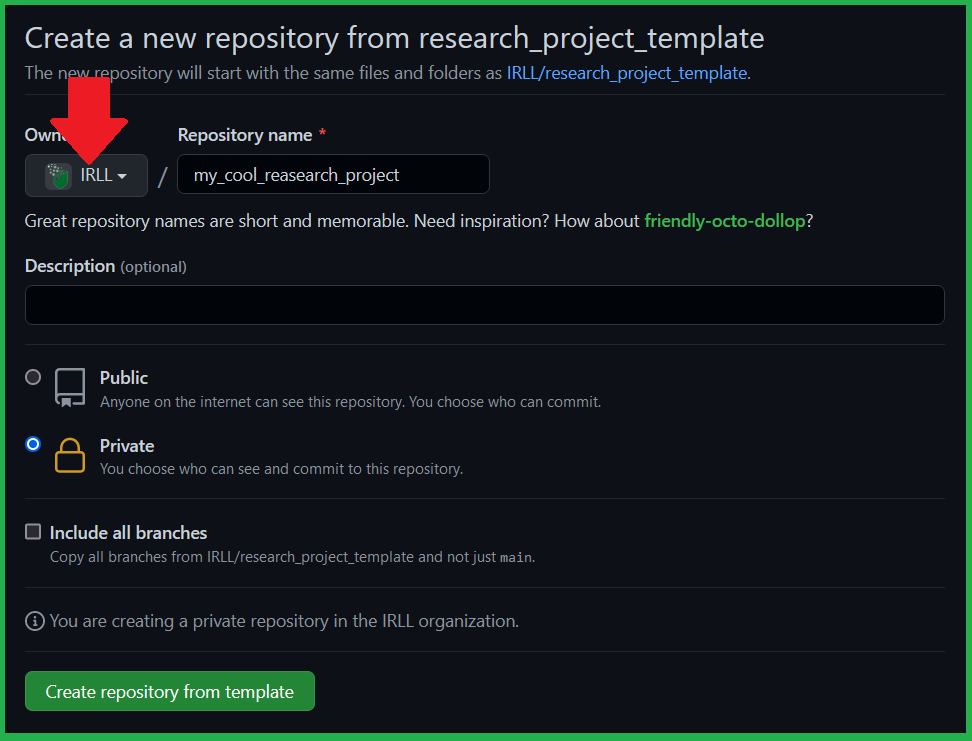

# Research project template

A GitHub template for research projects in the awesome IRL lab !

# Usage

Clic on the `Use this template` button to create a repository following this template.



Make sure that you create it in the IRLL GitHub organisation so others will be able to find it
and potentialy collaborate.



# Structure of the template

| Folder   | Use                                                       |
| -------- | --------------------------------------------------------- |
| `assets` | Store images or other assets use for presentation.        |
| `src`    | Source code                                               |
| `tests`  | Tests that ensure that the source code behave as expected |

| File                   | Use                                                                     |
| ---------------------- | ----------------------------------------------------------------------- |
| `.gitignore`           | Specify which files or folders should NOT be versioned                  |
| `LICENSE`              | License to allow other to use your code, default is Apache 2.0          |
| `pyproject.toml`       | Configuration file that allow `pip install` to work properly            |
| `requirements-dev.txt` | Python dependencies for developers of this codebase                     |
| `requirements.txt`     | Python dependencies for any user of this codebase                       |
| `setup.py`             | File that allow `pip install` to work properly (calls `pyproject.toml`) |

# Installation

## For others

This template allows you code to be packaged from the start !
So anyone can directly pip install it using:

```bash
> pip install git+https://github.com/IRLL/<repository_name>.git 
```

As such, dependencies in `requirements.txt` would be installed, try to keep them up to date !
(The continuous integration of tests will fail anyway if you don't ... more on that later !)

## Development

To get started and build reproductible research, here is a few things to do
before you can start to code.

### Clone

First clone your newly built repository.

```bash
> git clone https://github.com/IRLL/<repository_name>.git
```

### Make it your own !

First, choose a package name.
It should be short, descriptive of your research and start with `irll_`.
(Example: `irll_coolpkg`)

Then replace `mypackage` by your package name (make use of `Ctrl+H` shortcut):

-   In `src`
-   In `pyproject.toml`

### Virtual environment (optional but recommended)

It is advised to setup a virtual environment.

```bash
> python -m venv venv
```

And then to activate it

<details>
<summary>Windows</summary>
<br>
<pre>
venv\Scripts\activate
</pre>

</details>

<details>
<summary>Linux/MacOS</summary>
<br>
<pre>
source venv/bin/activate
</pre>
</details>
<br>

### Install your future code as an editable package

When developing, one can have import issues using different python files,
if you pip install your own code as an editable package, you won't ever have an import issue !

```bash
> pip install -e .
```

You can check your installation with the entrypoint provided that matches your package name:

```bash
> mypackage
Hello world from mypackage (A description of mypackage)
```

This runs code in the `main` function in `src/mypackage`,
that you can of course customize as you wish.

### Install developer requirements

As a developer, you must also install the developer requirements.

```bash
> pip install -r requirements-dev.txt
```
